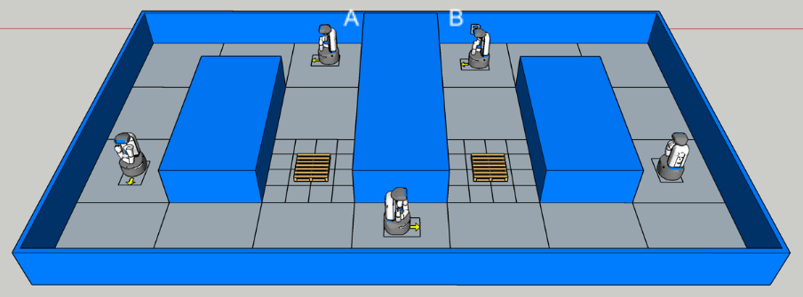

  
# UML HRI Nerve Navigation

## About:
  The UML HRI Nerve Navigation package is used for performing several navigation tests that help quantify important characteristics of a navigating robot. Examples of these characteristics include the performance of a robot's path planner, and the peformance of a robot's obstacle detection algorithms. A navigation test consists of an environment with two goals, goals A and B. The robot will start the test at goal A and then attempts to navigate to goal B.  Once the robot reaches goal B or the robot decides it cannot reach goal B, the robot will attempt to navigate back to goal A.  A single iteration of a navigation test will be completed once the robot either reaches or gives up navigating to goal A. To measure the repeatability of the robot's performance, a full navigation test will consist of multiple iterations of the robot traveling from goal A to goal B and back to goal A. After the test is complete, characteristics of a navigating robot can be found by comparing the robot's performace to the theoretical performance or the performace of a difference robot that completed  the same test. Depending on the configuration of the environement, different characteristics can be more easily measured than others.  For example, if one wanted to measure how well a robot can avoid small obstacles, small cubes can be inserted into the navigation environment.  The image below shows an example of a navigation test environment.
   

## Setup:
1. Clone this repository into your catkin workspace.
  > cd ~/<your_ws>/src   
  > git clone https://github.com/uml-robotics/uml_hri_nerve_navigation.git 
2. Build your catkin workspace.   
  > cd ..  
  > catkin build   
3. Source the workspace.  
  > source devel/setup.bash
4. Install package dependencies
  > rosdep update   
  > rosdep install uml_hri_nerve_navigation
5. If simulated tests are going to be performed, the UML HRI Nerve Nav Sim Resources package is also required.  To install, repeat the same commands above but replace the git clone command and the rosdep install command to the following:
  > git clone https://github.com/uml-robotics/uml_hri_nerve_nav_sim_resources.git  
  > rosdep install uml_hri_nerve_nav_sim_resources
5. Also, If simulated tests are going to be performed a setup bash script must be ran in the UML HRI Nerve Nav Sim Resources package before 
  > roscd uml_hri_nerve_nav_sim_resources    
  > . setup.sh

At this point, if all goes well, the package should be ready to run.  

**NOTE BEFORE STARTING:** Sometimes Gazebo can be a bit finicky, and may fail to launch properly for an array of reasons. If something goes wrong, Ctrl+c and try again a few times. If the problem persists there may be an actual issue that needs to be resolved first.

## Running a Test:   
1. In a terminal, run the run_test.sh bash script (This will launch all of the required nodes needed to run the test and then perform the test). The bash script can be run with the following arguments:
    * [MAP] - String argument that specifies which environment the robot will navigate in.  A list of avaliable levels can be found below.
    * [SIM] - Boolean argument that specifies whether to launch the test in simulation or not. (true/false)
    * [GUI] - Boolean argument that specifies whether to launch the Gazebo GUI or not. (true/false)
    * [ROBOT] - String argument that specifies which robot to use in the test.
    * [ITERATIONS] - Int Argument that specifies how many times the robot will travel from points A to B and B to A.
    * [OBSTACLE_BOT] - Boolean Argument that specifies whether to spawn a second robot that the other robot has to avoid. (true/false)

    The maps that are able to be launched are the following:
      * level1
      * level2
      * level3
      * level4
      * nerve_long_hall
      * nerve_physical (no simulated world)
      * nerve1_base_world
      * nerve1_full_regular
      * nerve1_full_low
      * nerve1_full_high
      * nerve1_full_high_clip
      * nerve1_half_regular
      * nerve1_half_low
      * nerve1_half_high
      * nerve2_base_world
      * nerve2_full_regular
      * nerve2_full_low
      * nerve2_full_high
      * nerve2_half_regular
      * nerve2_half_low
      * nerve2_half_high
      * nerve3_base_world

    The robots that are available to use are the following:
      * fetch
      * pioneer
      * mir (2d navigation only)

    The argument order for the bash script are the following
      * run_test.sh [MAP] [SIM] [ROBOT] [ITERATIONS]
      * run_test.sh [MAP] [SIM] [GUI] [ROBOT] [ITERATIONS]
      * run_test.sh [MAP] [SIM] [GUI] [ROBOT] [ITERATIONS] [OBSTACLE_BOT]

    The following command runs a test on level1 in simulation with the fetch robot and the robot performs 10 iterations (Note: This command is ran in the uml_hri_nerve_navigation directory)
      > . run_test.sh level1 true true fetch 10

## Stopping the Test:
If the test runs smoothly, then the bash script will automatically close the test and no action is needed.

If things inevitably go wrong, shutdown the terminal running the bash script with 'Ctrl+c', and start the estop to ensure the robot will stop moving via:  
  > roslaunch uml_hri_nerve_navigation estop.launch  

If in simulation and the robot gets stuck or leaves the desired navigation area, the position of the robot can be reset via:
  > roslaunch uml_hri_nerve_navigation reset_robot.launch  

## Adding a New Environment:
  TODO

## Adding a New Robot:
  TODO

## File Structure:  
* **launch/** - Contains all necessary ROS .launch files.  
  * **levels/** - Contains all of the .launch files for setting up the various navigation environments.
  * **navigation/** - Contains all of the .launch files used for navigation.
  * **robots/** - Contains all of the .launch files for setting up the various robots.
* **msg/** - Custom ROS message definition.  
* **resources/** - Package resources.  
  * **config/** - Contains the configurations for all of the robots.  Each robot has its own subfolder.  
  * **logs/** - Contains the logs from each performed test.  Subfolders are used to distinguish the logs from different tests.
  * **screenshots/** - Contains screenshots from various tests performed as well as visuals for documentation
  * **static_maps/** - Contains maps to be used for navigation
    * **2d/** - Contains 2d maps used by map_server
    * **3d/** - Contains octomaps used by octomap_server    
* **src/** - Contains all c++ source files.  
  * **estop.cpp** - Publishes zero velocity on the /cmd_vel topic at a fast rate in case of an emergency
  * **goal_pub.cpp** - Publishes the A and B goal point on the /goal and /goal_opposite topics and alternates the goal points after the robot reaches the goal it was navigating to.
  * **mover.cpp** - Reads the current goal on the /goal topic and commands the navigation stack to move to that goal.  
  * **obstacle_bot.cpp** - Commands the obstacle bot to move to various goals.
  * **logger.cpp** - Logs various robot data used to evaluate navigation tests.
  * **goal_pub.cpp** - Publishes a goal on the /goal topic.
  * **setup_fetch.cpp** - Resets Fetch's current state into a state that is state for navigation - TODO
* **run_test.sh** - A script that automatically launches and performs a test
## Important Launch Files:    
* **estop.launch** - A software emergency stop in case the robot gets out of control during a test.
  >roslaunch uml_hri_nerve_navigation estop.launch

* **rviz.launch** - Launches RVIZ with a default configuration that displays most of the important components used in the tests.  Each robot has a unique RVIZ configuration and the desired robot configuration is specified in the launch command.
  >roslaunch uml_hri_nerve_navigation rviz.launch robot:=pioneer

* **setup_<Desired_Robot>.launch** - Sets up the robot that is being used in the test.  If the test is in simulation and Gazebo is running, the robot will be spawned into the Gazebo environment, otherwise the necessary setup to run a physical robot will be performed.  This launch file includes a launch file inside of the /launch/robots folder depending on which robot is being used and whether the test is in simulation or not. 
To spawn a robot with a specified name and/or position (example):  
  > roslaunch uml_hri_nerve_navigation spawn_robot.launch robot:=pioneer x:=5.0 y:=5.0 yaw:=3.14 level:=level1 sim:=true

* **setup_test.launch** - Includes the spawn_world.launch and spawn_robot.launch in order to load a gazebo world if needed, and spawn a robot within it in just one file. The world file and robot spawn positions are sent to their respective launch files as arguments. You will notice that each level launch file simply includes this launch file and specifies the relevant arguments, making it easy to launch specific configurations. Changing the default values of the arguments in this file is perfectly acceptable, but you can specify them in a command as well.  
For example:  
  > roslaunch uml_hri_nerve_navigation setup_test.launch world_name:=level1 world_file:=level1 spawn_x:=0.0 spawn_y:=0.0 spawn_z:=0.0 spawn_yaw:=0.0 sim:=true robot:=pioneer

* **start_test.launch** - This launch file simply starts a logger node and a mover node simultaneously. The mover node is responsible for commanding the robot between goals A and B for a specified number of iterations and the logger node is responsible for publishing all of the robot data log during the test. The robot's costmap_clear service call between iterations can also be turned on and off using the boolean parameter clear_costmaps.
  > roslaunch uml_hri_nerve_navigation start_test.launch iterations:=5 clear_costmaps:=true

* **geotiff_writer.launch** - This launch file is responsible for logging the robots postion on a map over the course of the test. The logger will by default save maps to a /geotiff_maps folder inside of the resources folder.
  > roslaunch uml_hri_nerve_navigation geotiff_writer.launch
## Useful Resources:  
[ROS Tutorials](http://wiki.ros.org/ROS/Tutorials)  
[ROS .launch file documentation](http://wiki.ros.org/roslaunch/XML)  
[ROS Navigation](http://wiki.ros.org/navigation)  
[Navigation Tuning Guide](https://wiki.ros.org/navigation/Tutorials/Navigation%20Tuning%20Guide)    
[Nav Tuning Guide Paper](http://kaiyuzheng.me/documents/navguide.pdf)   

